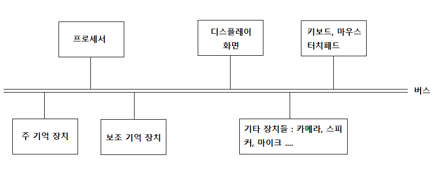

# 002 프로세서 속도와 심장 박동수

일반적인 컴퓨터를 단순화한 추상적인 그림
즉, 논리적 또는 기능적 아키텍처

**프로세서**, **주 기억 장치**, **보조 기억 장치**, 다른 다양한 구성 요소가 있으며, 그 중간에 정보를 전달하는 **버스**라는 여러 개의 전선이 있어 서로 연결

이처럼 프로세서, 명령어와 데이터를 담는 메모리와 저장 장치, 입력과 출력 장치가 있는 기본 구조는 1940년대 이래 이어지는 표준
이러한 구조를 **폰 노이만 아키텍처**라고 한다.

> 프로세서는 산술 연산과 제어 기능을 제공하고, 주 기억 장치와 보조 기억 장치는 기억과 저장을 담당하며, 키보드, 마우스, 디스플레이는 운영자와 상호작용한다.

<u>프로세서</u>는 역사적으로 **CPU**라고 불렸지만, 지금은 그냥 프로세서 불림.
<u>주 기억 장치</u>는 **RAM** 이라고도 불림.
<u>보조 기억 장치</u>는 다양한 물리적 구현을 반영해서 **디스크**나 **드라이브**라고도 불림.

## 프로세서(processor)

컴퓨터의 두뇌에 해당

산술 연산을 하고, 데이터를 여기저기로 옮기며, 다른 구성 요소의 작업을 제어

프로세서가 수행할 수 있는 기본적인 레퍼토리는 적지만, 빠르게 연산을 수행.
기존 계산 결과를 바탕으로 다음에 수행할 연산을 결정할 수 있어서, 사용자가 일일이 개입할 필요 없이 독립적으로 작동

예시) 컴퓨터의 프로세서가 2.2GHz 듀얼 코어 인텔 Core i7
인텔은 제조사, Core i7은 제품군
듀얼 코어는 하나의 패키지에 처리 장치가 두 개 있다는 의미. 여기에서 코어는 프로세서와 동의어(즉, 프로세서가 2개)
2.2GHz - 프로세서는 기본 연산을 단계별로 수행하기 위해 내부 클록을 사용, 이는 심장 박동이나 시계의 째깍거림과 유사. 초당 한 번 뛰거나 째깍하는 것이 1Hz

## 주 기억 장치(primary memory)

프로세서와 컴퓨터의 다른 부분이 현재 <u>사용 중인 정보를 저장</u>하는데, 저장된 정보의 내용은 프로세서에 의해 변경될 수 있음.

프로세서가 현재 작업 중인 데이터뿐만 아니라 프로세서가 그 데이터로 무엇을 해야 하는지 알려 주는 명령어도 저장.(매우 중요)
메모리에 다른 명령어를 로드(적재)하여 프로세서가 다른 계산을 수행하게 할 수 있음.
이러한 원리로 **프로그램 내장식** 컴퓨터는 범용 장치가 된다.
-> 같은 컴퓨터로 워드, 스프레드 시트를 실행하고, 웹 서핑, 이메일, 페이스북, 음악 재생 등, 이 모든 일이 적합한 명령어를 메모리에 배치함으로써 가능. (프로그램 내장식이라는 아이디어는 매우 중요)

주 기억 장치는 컴퓨터가 실행되는 동안 정보를 저장할 장소를 제공.
현재 활성화된 프로그램의 명령어를 저장. 아울러 그러한 프로그램의 데이터, 즉 작업 문서, 재생중인 음악 등을 저장.
애플리케이션 여러 개를 동시에 실행할 수 있도록 배후에서 작동하는 운영체제의 명령어도 저장.

주 기억 장치를 **RAM(Random Access Memory)**, 즉 <u>'임의 접근 메모리' 라고도 부르는 이유</u>는 <u>프로세서가 정보에 접근할 때 메모리에 저장된 위치와 무관하게 같은 속도로 접근</u>할 수 있기 때문

반대로 비디오 테이프 같은 경우, 마지막을 보려면 처음부터 빨리 감기로 순차적으로 마지막에 접근을 한다. 이를 **순차적 접근(sequential access)**

대부분의 메모리는 **휘발성**을 띤다. 즉, 전원을 끄면 메모리의 내용이 사라지고 현재 활성화된 모든 정보가 없어진다.

주 기억 장치의 용량은 고정되어 있음. 메모리 단위는 바이트 단위로 측정. (1바이트 = W, @(단일문자), 42(작은 수), 더 큰 값의 일부)

